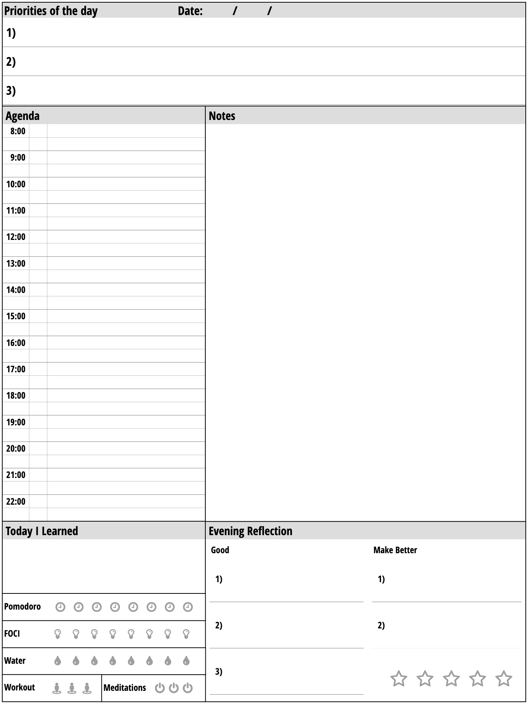
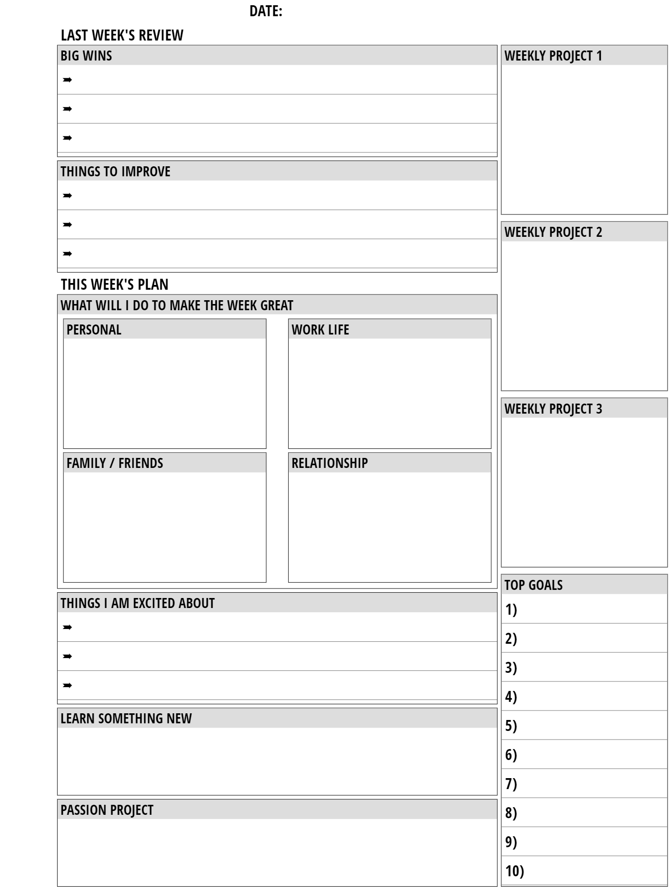
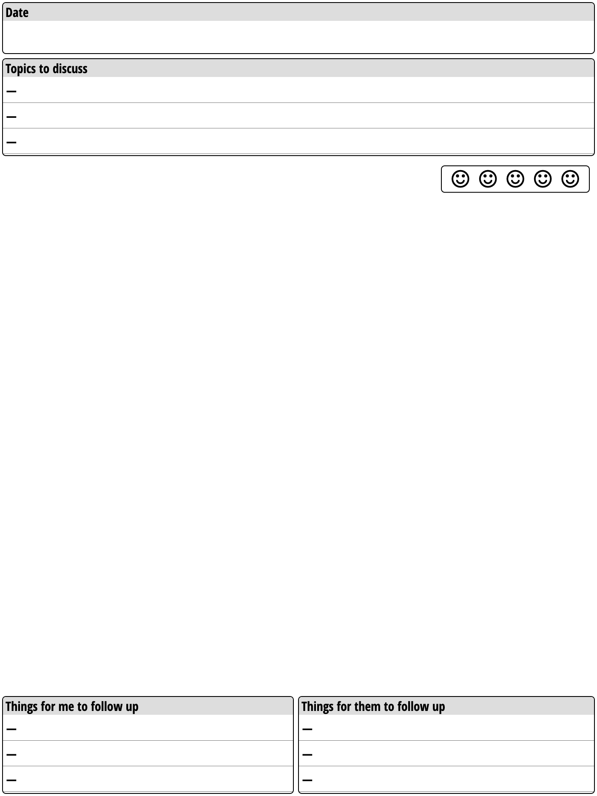

# Remarkable 2 templates

The templates are built using [NoTeTo](https://noteto.needleinthehay.de/) template builder. If you'd like to change, use the *Load from JSON* option on the tool, select the template you'd like to change from ```templates/```, make your changes on the GUI and don't forget to save the JSON.

## Daily journal


I keep daily journal every morning. I start with stating 3 gratitudes and the remaining is free-form writing. At the end I assess how I feel. 

## Daily planner


I use this template to review my daily priorities and agenda a day before. At the end of the day, I fill in the bottom part with TIL, reflections. I compare the stars in this template with the hearts in *Daily Journal* to see if there is a discrepancy. The section with the icons are representing the behaviors that I'd like to incorporate in my life:

* Each **pomodoro** icon represents a [pomodoro](https://todoist.com/productivity-methods/pomodoro-technique) session (25mins work/5mins break) 
* I have a [**FOCI**](https://fociai.com/) device which logs my emoitions throughout the day. It also provides the amount of time that I spend in focus daily. Every clock icon represents 30mins of focus time.
* Each **water droplet** represents 500ml of water
* Each **workout** and **meditation** icon represents 30mins
 

## Weekly planner


Every Sunday, I reflect on the past week and plan for the upcoming week.

## Meeting / 1:1 notes


## How to install the templates on Remarkable

Please follow [this guide](https://remarkablewiki.com/tech/ssh) to setup the SSH access to your device. The install script uses the same config. Once you are done with the config test:

```$ ssh rem```

For the json merge operation, we'd need [jq](https://github.com/stedolan/jq) in the PATH.

```
$ brew install jq
...
$ which jq
/opt/homebrew/bin/jq
```

If the connection is successful & jq is in the path, please run the install script:

```
$ ./install.sh

daily_planner.png                                          100%  150KB   1.3MB/s   00:00
journal.png                                                100%   66KB   1.2MB/s   00:00
weekly_planner.png                                         100%  117KB   1.8MB/s   00:00
meeting_notes.png                                          100%   78KB   1.4MB/s   00:00
templates.json                                             100%   13KB 941.0KB/s   00:00
templates.merged.json                                      100%   14KB 849.3KB/s   00:00

```
